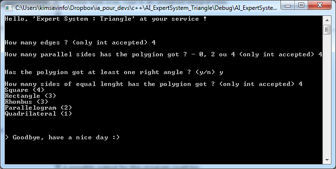
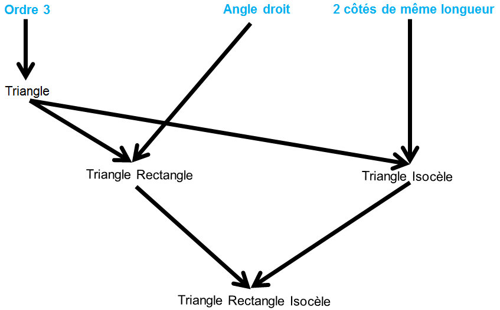
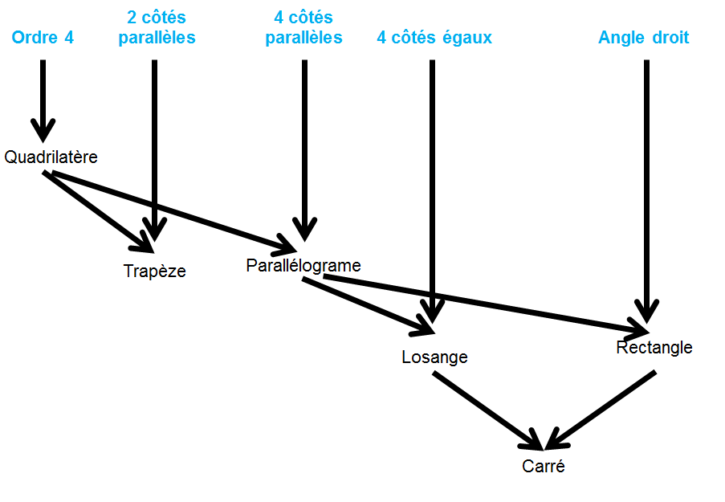
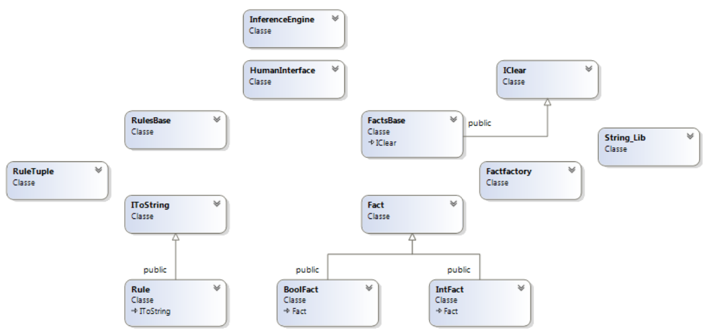

# Système Expert : Polygones

Un système expert a une base de connaissance.
Cette dernière est constituée de plusieurs règles logiques qui sont sous la forme suivante :
SI (ensemble de conditions ou prémisses) ALORS nouvelle conclusion

Prenons par exemple un système expert sur les quadrilatères : 
- SI (un polygone est d'ordre 4) ALORS le polygone est un quadrilatère. 
- SI (le polygone est un quadrilatère ET il n'a que deux côtés parallèles) ALORS c'est un trapèze.

Nous pouvons remarquer que "un polygone est d'ordre 4" est une prémisse.
"le polygone est un quadrilatère" est une conclusion.

Nous observons également que des conclusions peuvent être considérées comme des prémisses pour d'autres règles.
"le polygone est un quadrilatère" illustre ce fait.
Vous avez donc à disposition un projet en C++ un système expert sur les polygones d'ordre 3 et 4.

L’objectif principal de ce projet personnel n’était pas de construire une liste exhaustive des règles
concernant les polygones, mais plutôt de comprendre la logique d’un système expert.
De plus, j’ai apporté un soin particulier à créer un système expert le plus générique possible afin de pouvoir
le réutiliser plus tard pour n’importe quel autre projet.

